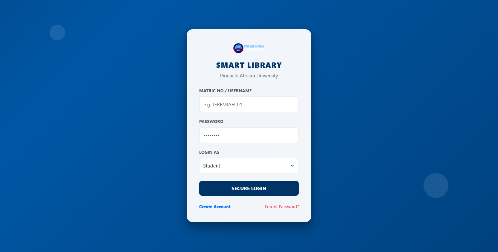
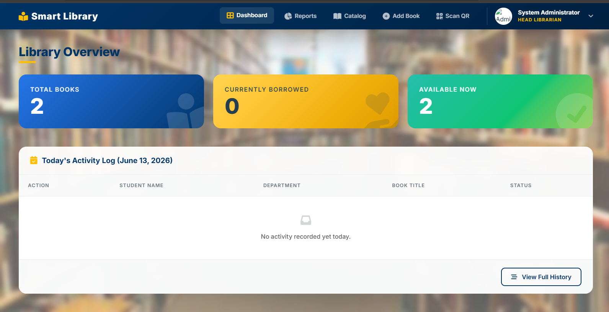
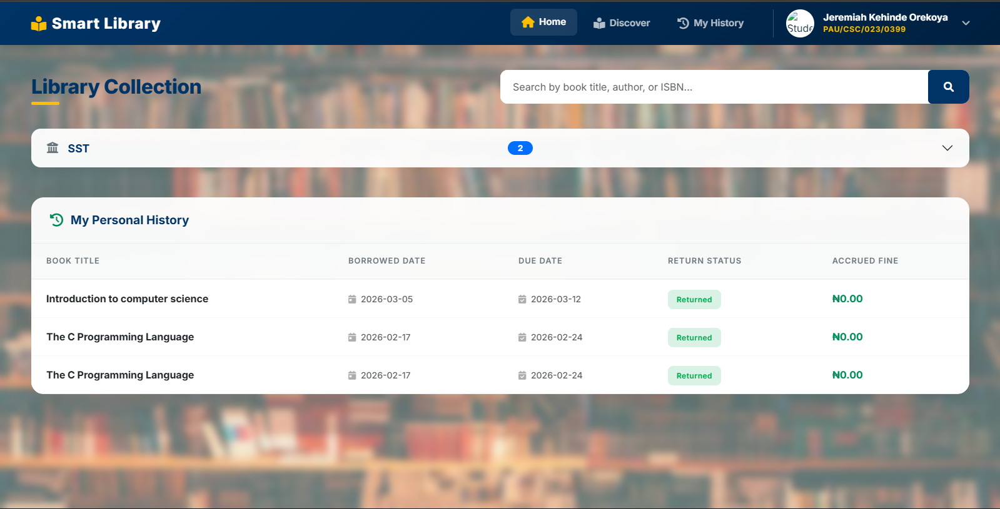
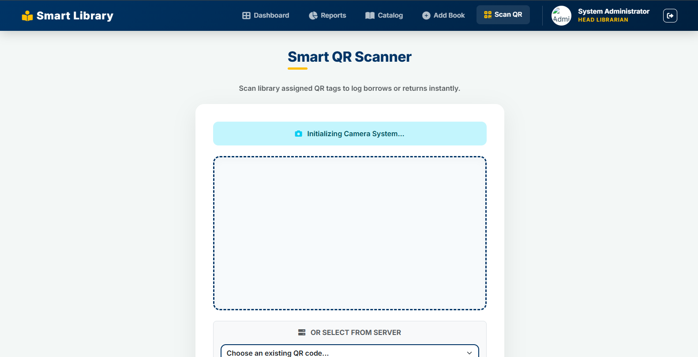

# Smart Library — University Library Management System

> A full-stack library management system with QR-based book scanning, role-based dashboards, and automated fine tracking, built for Pinnacle African University (PAU-Benin).

[](https://library-pinnacleafricanuni.page.gd)
[](./LICENSE)
[](https://php.net)
[](https://mysql.com)

---

## 🔗 Live Demo

**[library-pinnacleafricanuni.page.gd](https://library-pinnacleafricanuni.page.gd)**

---

## 📸 Screenshots

| Login Portal | Admin Dashboard |
|---|---|
|  |  |

| Student Library Collection | QR Scanner |
|---|---|
|  |  |

---

## About

Smart Library is a full-stack library management platform built for Pinnacle African University (PAU), Benin Republic. It provides separate dashboards for librarians (admins) and students, with QR-code-based book scanning for instant borrow/return logging, automated fine calculation, and detailed activity reporting.

---

## Features

- 🔐 **Secure Authentication** — Role-based login (Admin/Student) with brute-force rate limiting, session regeneration, and `password_hash()` / `password_verify()`
- 📚 **Library Collection Browser** — Students can search and browse books by department/faculty
- 📋 **Borrow History & Fines** — Students view their personal borrowing history with due dates, return status, and accrued fines
- 👨‍💼 **Admin Dashboard** — Real-time stats (total books, currently borrowed, available) and a daily activity log
- 📱 **QR Code Scanning** — Librarians scan book QR tags via camera or select from server to instantly log borrows/returns
- 📊 **Reports** — Full borrowing history and activity reports
- ➕ **Book Catalog Management** — Add, edit, and manage the book catalog
- 🛡️ **Security Hardening** — XSS sanitization via `htmlspecialchars()`, prepared statements (PDO/mysqli), global HTTP 500 error interception to mask stack traces

---

## Tech Stack

| Layer | Technology |
|---|---|
| Backend | PHP 8.x |
| Database | MySQL |
| Frontend | HTML5, Bootstrap 5, Vanilla JavaScript |
| QR Codes | phpqrcode library |
| Auth | PHP Sessions + `password_hash()` |
| Deployment | InfinityFree |

---

## Roles & Access

| Role | Access |
|---|---|
| **Admin (Librarian)** | Manage catalog, add books, view reports, scan QR codes for borrow/return |
| **Student** | Browse collection, view personal borrow history and fines |

---

## Getting Started (Local)

### Prerequisites

- PHP 8.x
- MySQL (XAMPP or any local server)

### 1. Clone the repo

```bash
git clone https://github.com/Engrojkeh/pau_library.git
cd pau_library
```

### 2. Database Setup

1. Open MySQL (XAMPP or Workbench)
2. Create a database named `pau_library`
3. Import the schema:
```bash
mysql -u root -p pau_library < database_schema_full.sql
```

### 3. Configure environment variables

```bash
cp .env.example .env
```

Edit `.env` with your local database credentials:

```
DB_HOST=localhost
DB_USER=root
DB_PASS=your_password
DB_NAME=pau_library
```

> ⚠️ Never commit `.env` — it is in `.gitignore`

### 4. Run locally

Place the project folder in your XAMPP `htdocs/` directory and visit:
```
http://localhost/pau_library
```

---

## Project Structure

```
pau_library/
├── assets/                  # Images and background assets
├── js/                       # JavaScript files (faculties.js, etc.)
├── libs/phpqrcode/           # QR code generation library
├── index.php                 # Login page
├── register.php              # Student registration
├── dashboard_admin.php        # Admin dashboard
├── dashboard_student.php       # Student dashboard
├── book_catalog.php           # Book catalog management
├── add_book.php               # Add new books
├── scan_book.php              # QR scanner interface
├── process_borrow.php         # Borrow/return processing logic
├── reports.php                # Activity reports
├── profile.php / admin_profile.php  # User profiles
├── security.php               # Security middleware
├── db_conn.php                # Database connection (env-based)
├── .env.example               # Environment variable template
├── database_schema_full.sql   # Full database schema
└── README.md
```

---

## Security Practices

- Prepared statements (mysqli) — prevents SQL injection
- `password_hash()` / `password_verify()` — secure password storage
- Brute-force rate limiting on login (5 attempts / 15 min lockout)
- Session regeneration on login — prevents session hijacking
- XSS sanitization via `htmlspecialchars()`
- Global HTTP 500 error interception — masks stack traces in production
- Environment-based database credentials (`.env`, gitignored)

---

## License

This project is licensed under the [MIT License](./LICENSE).

---

## Author

**Engrojkeh** · [GitHub](https://github.com/Engrojkeh) · [Live Site](https://library-pinnacleafricanuni.page.gd)
